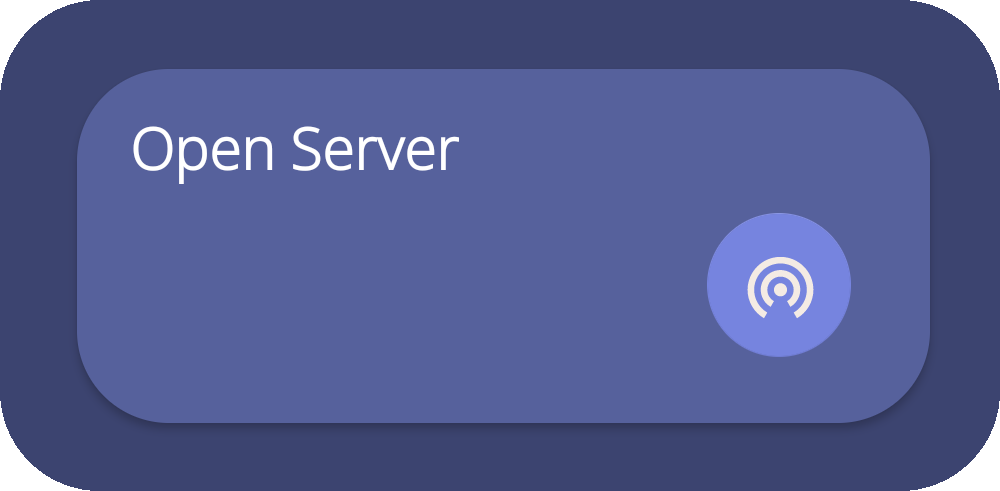
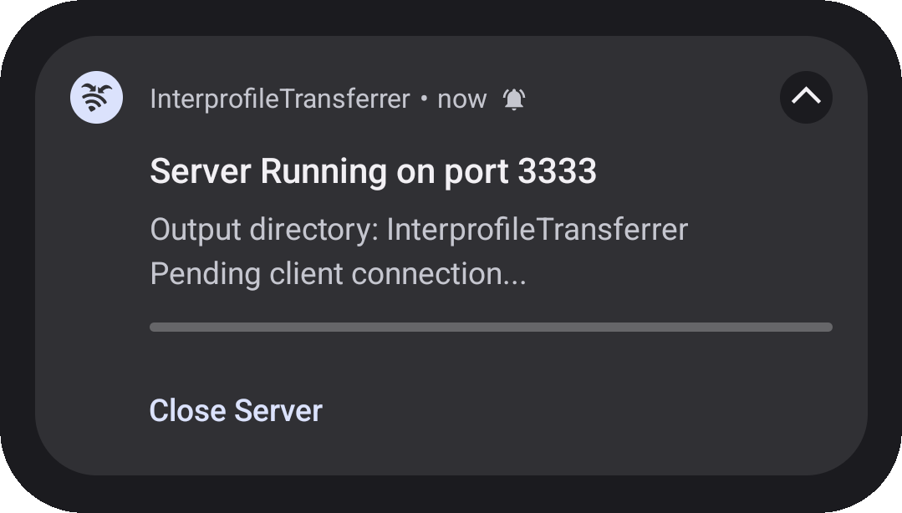
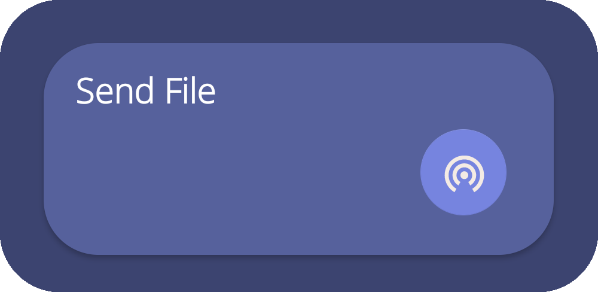
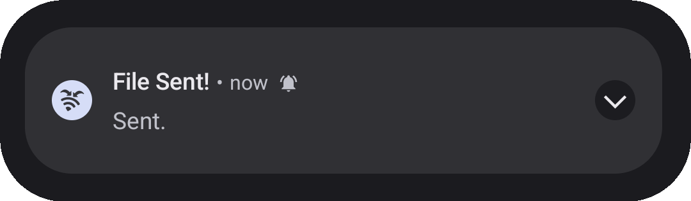

# Interprofile Transferrer

This open-source Android app quickly and securely transfers files between GrapheneOS profiles.

## Contact

VeryRandomCreator's email: `veryrandomcreator@gmail.com`

## GrapheneOS Target Audience

This app targets devices operating on GrapheneOS specifically, to take advantage of the multi-profile feature it provides. This app provides no use to devices without the multiple profile feature.

### Security

Keeping GrapheneOS' security-oriented users in mind while developing the InterprofileTransferrer, the file transfer mechanic is done without third-party software and can be done offline. This minimizes the possibility of data being intercepted during transfer.

For a more detailed explanation: The file is transferred using a client and server socket, running and accessing on IP `127.0.0.1` with the chosen port. 

### Open-source

To support the open-source developer community, and to follow the ideals of general GrapheneOS users, the InterprofileTransferrer is completely open-source. All permissions and other security-related matters can be found in the project's [Privacy Policy](https://github.com/VeryRandomCreator/InterprofileTransferrer/blob/master/PRIVACY_POLICY.md).

## Download

### Google Play

Google Play and the Google Play logo are trademarks of Google LLC.

### F-Droid

Coming soon...

## Specifics

    

  

## Setup

The only setup requirement to transfer files between profiles is to have the app downloaded on the desired profiles.
The notifications permission is required to launch the foreground service which sends/receives files. If the app does not have permission, you will be prompted with a permission request. All permissions used in the app are detailed in the [Privacy Policy](https://github.com/VeryRandomCreator/InterprofileTransferrer/blob/master/PRIVACY_POLICY.md).

## Usage Guide

The following is a quick guide to sending a file between profiles using the InterprofileTransferrer:
1. **Setup Server**
    1. Select the output directory:
       Click the folder upload button in the "Select Directory" card. A folder selection prompt will appear, allowing you to select the directory for files to be transferred.

       
       
       <i>Above is an image of the "Select Directory" card.</i>
       
    3. Start the server service:
       Click the start server button in the "Open Server" card. If the app cannot access to the notification, you will be prompted to accept and try again. If successful, a notification will appear to keep the foreground service active and display information about the server. 
       
       
       
       <i>Above is an image of the "Open Server" card.</i>
  
       
       
       <i>Above is an image of the notification received when the server is successfully started</i>
       
1. **Setup Client**
    1. Select the file to transfer:
       Click the File Upload button in the "Select File" card. A file selection prompt will appear, allowing you to select the file to be transferred.
       
       
       
       <i>Above is an image of the "Select File" card.</i>
       
    3. Click the Send File button in the "SendFile" card. If the app cannot access to the notification, you will be prompted to accept and try again. If successful, a notification will appear to keep the foreground service active and display information about the client.
       
       
       
       <i>Above is an image of the "Send File" card.</i>
       
       
       
       <i>Above is an image of the notification received when the client is successfully started</i>

## Debugging

If any problems occur, a toast will appear with the problem. If a mechanism does not work or the app crashes and a toast does not appear, report the problem to veryrandomcreator@gmail.com. 

If there are any problems or bugs, feel free to email veryrandomcreator@gmail.com.

If you receive `Service error: Client service is already running! (If incorrect, clear app storage)` or `Service error: Server service is already running! (If incorrect, clear app storage)` while the client or server services are not running, clear the app storage and restart the app. If this error occurs frequently, please report it to veryrandomcreator@gmail.com.

## Developer and Attributions

This app was designed and developed by VeryRandomCreator.

All attributions can be found in [NOTICE.md](https://github.com/VeryRandomCreator/InterprofileTransferrer/blob/master/NOTICE.md)

Additional thanks to a very useful online [SVG Path Editor](https://yqnn.github.io/svg-path-editor/). This was used to modify certain icons of the Material Design icons by Google to create some of the icons used in the project. This resource is a very well-made open-source tool.

## Final Comments

I originally made this app to solve the problem I faced when transferring files between GrapheneOS profiles. I decided to publish it to gain experience and grow an online developer presence.

## Contact

If there are any problems, questions, or concerns do not hesitate to contact by email.

Thank you,  
VeryRandomCreator

veryrandomcreator@gmail.com
